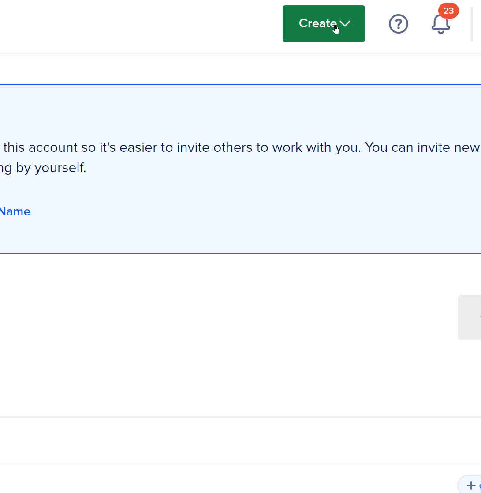
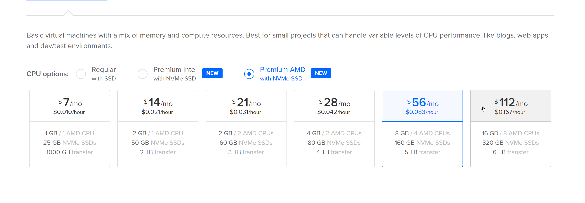
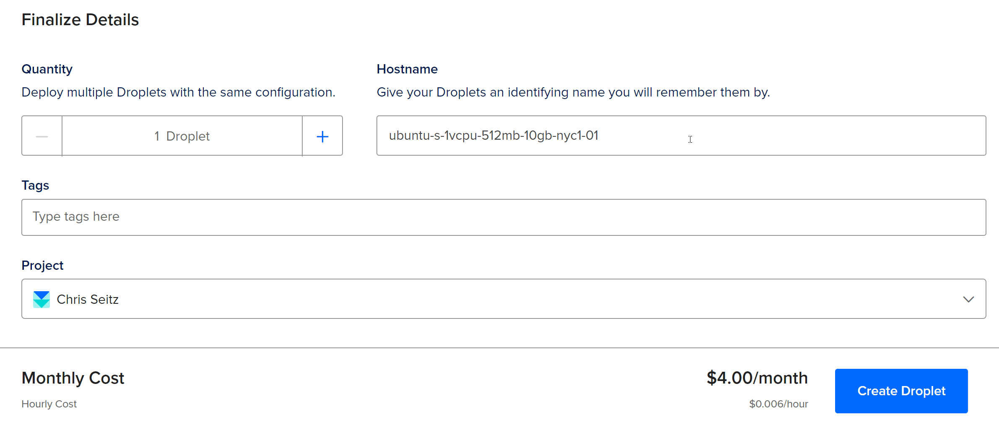

# Deployment!

Have a website or project? Want to host it in the cloud and make it accessible to users? You need to deploy your application!

This lesson goes through how to set up a DigitalOcean droplet and deploy your application to the cloud!

## Referral Code

Click the badge below to get $200 credits for DigitalOcean!

## Registration

Start by clicking the badge above to get free credit, then create an account!

## Droplet Creation

DigitalOcean has these things called "droplets", which are little Virtual Private Servers, or put simply, computers hosted in the cloud!

You can create a droplet by going to `Create` in the top right, then `Droplet`!

### Droplet Tier

From there, you should **definitely** change the droplet tier!

They have tons of different tiers, and you're $200 in free credits should support almost everything they offer for this weekend if you want to host your project! But remember to cancel your droplets when you are done using them!

### SSH Keys & Authentication

You need to setup SSH key authentication ot just check `Use Password`!

### Rename the Droplet

Give your droplet a name, then click `Create Droplet`!

## Logging in to your Droplet

[ click create console ]

## Uploading Files

Download a file transfer program such as [WinSCP](https://winscp.net/eng/index.php) so you can connect to your server!

Use the login information provided by DigitalOcean!

If you are having trouble, read [this post](https://docs.digitalocean.com/products/droplets/how-to/transfer-files/) by DigitalOcean on how to transfer files to your droplet with FileZilla! DigitalOcean covers all the specifics for how to make this work!

